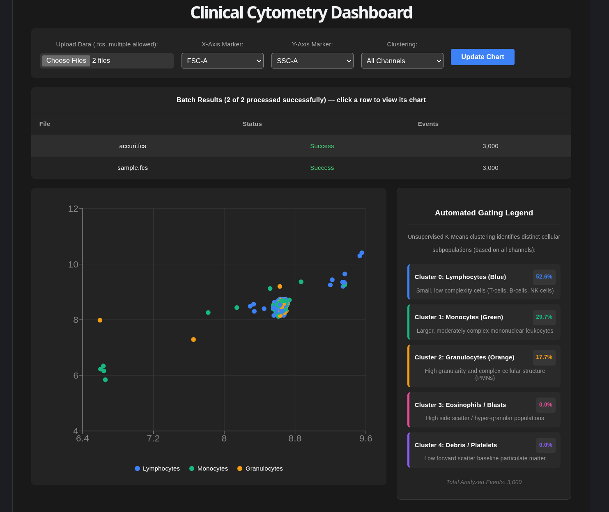

# Clinical Cytometry Dashboard

An interactive web dashboard for exploring flow cytometry data. Upload an `.fcs` file, pick any two markers to plot against each other, and view automated K-Means gating with a live-updating scatter plot, color-coded clusters, and per-population statistics.




## Features

- **Drag-and-drop `.fcs` upload** with clear validation (rejects non-FCS files with a helpful error instead of failing silently)
- **Configurable X/Y axes** — choose any two channels detected in the uploaded file (forward/side scatter, fluorescence channels, etc.)
- **Automated gating** via K-Means clustering (scikit-learn), with clusters mapped to common leukocyte populations (lymphocytes, monocytes, granulocytes)
- **Two clustering modes**: cluster on all channels at once (consistent populations across every view) or on just the two currently-selected axes (visually clean groupings for any pair, at the cost of consistency across views)
- **Arcsinh-transformed** channel data, the standard transformation for flow cytometry visualization
- **Live statistics panel** showing per-cluster event counts and percentages
- **Downsampling** to 3,000 events for smooth rendering on high-event clinical files

## Architecture

```
┌─────────────────────┐        POST /api/cluster        ┌──────────────────────┐
│   Frontend (React)  │ ───────────────────────────────▶ │   Backend (FastAPI)  │
│   Vite + TypeScript │                                   │   Python 3.11        │
│   Recharts          │ ◀─────────────────────────────── │   fcsparser + sklearn │
│   served by nginx    │        { columns, data }         │   uvicorn             │
└─────────────────────┘                                   └──────────────────────┘
      localhost:5173                                             localhost:8000
```

- **Frontend**: React + TypeScript, built with Vite, charted with Recharts, served in production as a static build behind nginx.
- **Backend**: FastAPI service that accepts an uploaded `.fcs` file plus the two requested marker names, parses it with `fcsparser`, applies an arcsinh transform, runs K-Means clustering (`k=3`) across all numeric channels, and returns the resolved column list plus a downsampled set of `{x, y, cluster}` points as JSON.
- Both services run as separate Docker containers, orchestrated with Docker Compose, communicating over HTTP on the host network (`localhost:8000`).

## Getting Started

### Prerequisites

- [Docker](https://docs.docker.com/get-docker/) and Docker Compose

### Run with Docker Compose

```bash
git clone <your-repo-url>
cd cytometry-pipeline
docker compose up --build
```

This builds and starts both services:
- Frontend: [http://localhost:5173](http://localhost:5173)
- Backend API docs (Swagger UI): [http://127.0.0.1:8000/docs](http://127.0.0.1:8000/docs)

Once both are running, open the frontend, upload a `.fcs` file, and select your X/Y markers.

To stop everything:
```bash
docker compose down
```

To rebuild after making code changes:
```bash
docker compose down
docker compose up --build -d
```

### Running locally without Docker (alternative)

If you'd rather run each service directly on your machine for faster iteration during development:

**Backend:**
```bash
python -m venv venv
source venv/bin/activate  # or `venv\Scripts\activate` on Windows
pip install -r requirements.txt
uvicorn main:app --reload
```

**Frontend** (in a separate terminal, from the `frontend/` directory):
```bash
cd frontend
npm install
npm run dev
```

The frontend expects the backend at `http://localhost:8000` — make sure both are running for the upload flow to work.

## Project Structure

```
cytometry-pipeline/
├── main.py                 # FastAPI backend — clustering, FCS parsing
├── requirements.txt        # Python dependencies
├── Dockerfile               # Backend container definition
├── docker-compose.yml      # Orchestrates frontend + backend
└── frontend/
    ├── src/
    │   └── App.tsx          # Main dashboard component
    ├── Dockerfile            # Frontend container definition (multi-stage: Node build → nginx serve)
    └── package.json
```

## Testing

The backend has a pytest suite covering file validation, axis-switching correctness, downsampling, and both clustering modes:

```bash
pip install -r requirements-dev.txt
python -m pytest tests/ -v
```

Tests run automatically on every push and pull request via GitHub Actions (see `.github/workflows/backend-tests.yml`).

## API

### `POST /api/cluster`

Accepts a multipart form with:
- `file`: the `.fcs` file to analyze
- `markers`: comma-separated marker names to plot, e.g. `"FSC-A,SSC-A"`

Returns:
```json
{
  "columns": ["FSC-A", "SSC-A", "FL1-A", "..."],
  "data": [
    { "x": 6.53, "y": 3.28, "cluster": 0 },
    ...
  ]
}
```

On invalid input (wrong file type, unparseable FCS file), returns:
```json
{ "error": "Human-readable explanation of what went wrong." }
```

## Notes on Clustering

Cluster assignment is computed via unsupervised K-Means (`k=3`) across **all** numeric channels in the file by default, not just the two currently plotted on X/Y. This means the color-coded populations represent the overall cellular subpopulations in the sample, and stay consistent as you switch which two channels you're viewing — but it also means the cluster boundaries won't align with a 2D decision boundary on any single axis pair. An alternate "Selected Axes Only" mode is available that clusters using just the two currently plotted channels instead, which will always look visually clean on whatever axes are shown, at the cost of cluster identities changing each time you switch axes.

**Known limitations of the current approach**, and what a production version would need instead:

- **K-Means assumes spherical, evenly-sized clusters.** Real immune cell populations are rarely that clean — they overlap, have very different sizes, and can have irregular/elongated shapes in high-dimensional marker space. Density-based methods (DBSCAN, or cytometry-specific tools like FlowSOM) or Gaussian Mixture Models handle this more realistically.
- **`k=3` is hardcoded.** A real gating pipeline needs to either determine the number of populations dynamically (e.g. via silhouette score, BIC/AIC for GMMs) or support hierarchical/sequential gating, where an analyst progressively gates sub-populations out of larger ones — which is how gating is actually done in practice, rather than a single flat clustering pass.
- **No compensation/spillover correction.** Real fluorescence channels have spectral overlap between fluorochromes that needs to be compensated for before clustering is meaningful; this prototype clusters on raw (arcsinh-transformed) channel values directly.
- **No batch effect correction.** Comparing across samples/instruments/days in a real clinical pipeline requires normalization methods (e.g. CytoNorm) that this prototype doesn't attempt.

## Scaling & Production Considerations

This project is intentionally scoped as a learning prototype — a single `.fcs` file, processed synchronously, in memory, on one machine. That works fine for exploration but wouldn't hold up at the scale described in a real clinical pipeline (an individual immune profile can contain 100M+ data points, and a lab may be processing many samples per day). Here's what would need to change, roughly in the order I'd tackle them:

1. **Streaming / chunked file reads.** `fcsparser.parse()` currently loads the entire file into memory as a single `pandas.DataFrame`. For very large files, this should instead read in chunks (or use a library/format that supports out-of-core processing) so memory usage doesn't scale linearly with file size.
2. **Asynchronous, queued processing.** The current `/api/cluster` endpoint blocks the request until clustering finishes. A production version would accept the upload, hand the job to a background worker queue (e.g. Celery + Redis, or a cloud-native equivalent like AWS SQS + Lambda/Batch), and let the client poll or subscribe for results — both for responsiveness and to allow batch processing of multiple samples without blocking the API.
3. **Object storage instead of local temp files.** Uploaded files are currently written to a local `tempfile` on the container's filesystem. In a multi-instance deployment, that doesn't work — files should go to object storage (e.g. S3) that any worker instance can access.
4. **Columnar / off-heap data formats for very large datasets.** For genuinely massive high-dimensional cytometry data, tools like Dask or Vaex (or converting to Parquet/Arrow) would let clustering and aggregation happen without pulling everything into RAM at once.
5. **Horizontal scaling of the clustering step itself.** K-Means over tens of millions of events benefits from a distributed implementation (e.g. Spark MLlib's K-Means, or mini-batch K-Means for a single-machine approximation) rather than scikit-learn's in-memory implementation.
6. **Observability.** Structured logging, request tracing, and basic metrics (processing time per file, queue depth, error rates) would be essential for something running against active clinical trial data, where a silent failure has real consequences.

None of this is implemented here — the goal of this section is to be explicit about where the current prototype's ceiling is, and what I'd reach for first to raise it.

---

Built as part of a hands-on data engineering / full-stack crash course covering FastAPI, React, Docker, and applied clustering on real clinical instrument data.
